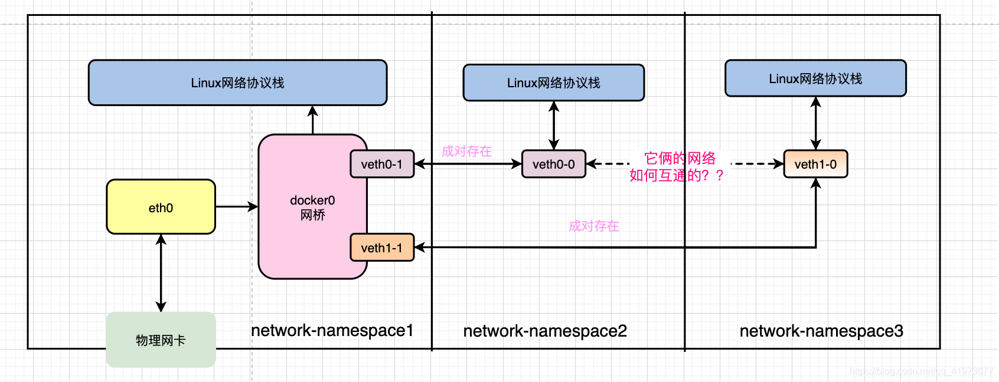
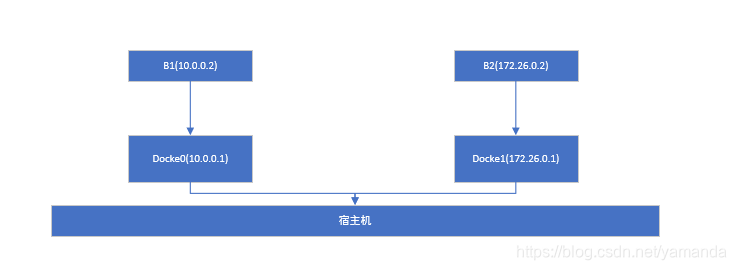

# Docker 网络综述
## 1. 相关概念说明
概念	| 说明
:-- | :--|
网络协议栈	|Linux网络协议栈是一组实现网络通信协议的软件层，用于在Linux操作系统中管理网络通信。它包含多个层次，每个层次执行不同的任务，协同工作以实现可靠的网络通信。
网络命名空间	|<p>在 Linux 中 &#xff0c;网络命名空间可以被认为是隔离的拥有单独网络栈 &#xff08;网卡、路由转发表、iptables &#xff09;的环境。网络命名空间经常用来隔离网络设备和服务 &#xff0c;只有拥有同样网络命名空间的设备 &#xff0c;才能看到彼此。</p>
veth-pair技术	|veth-pair 是 Linux 内核中的一项技术，用于创建虚拟以太网对（Virtual Ethernet Pair）。这对虚拟设备成对出现，一端连接到网络命名空间中的一个设备，另一端连接到另一个网络命名空间中的设备。这种技术通常用于创建网络命名空间之间的虚拟网络连接。
docker0| 安装完docker之后，docker会为我们创建一个叫docker0的网络设备,它是一个docker默认桥接网桥。
## 2. Docker的网络模式
<table><thead><tr><th align="left">网络模式</th><th align="left">设置命令</th><th align="left">详细说明</th><th align="left">应用场景</th></tr></thead><tbody><tr><td align="left">host模式</td><td align="left">- -net&#61;host</td><td align="left">host模式&#xff0c;容器不会获得一个独立的network namespace&#xff0c;而是与宿主机共用一个network namespace&#xff0c;容器不会虚拟出自己的网卡、配置自己的ip等&#xff0c;而是使用宿主机的ip和端口。</td><td align="left">当网络不应与Docker主机隔离&#xff0c;但又希望容器的其他方面隔离时&#xff0c;主机网络是最佳选择。</td></tr><tr><td align="left">container模式</td><td align="left">- -net&#61;container</td><td align="left">container模式&#xff0c;指定新创建的容器和已经存在的一个容器共享一个network namespace&#xff0c;而不是和宿主机共享&#xff0c;新创建的容器不会创建自己的网卡、配置自己的ip&#xff0c;而是和指定的容器共享ip、端口等。两个容器除网络方面相同外&#xff0c;其他的如文件系统、进程列表等还是隔离的。</td><td align="left"></td></tr><tr><td align="left">none模式</td><td align="left">- -net&#61;none</td><td align="left">none模式&#xff0c;容器拥有自己的network namespace&#xff0c;但是并未对容器进行任何网络配置&#xff0c;需要手工为容器添加网卡、配置ip等。可以使用pipework工具为容器指定ip等信息。</td><td align="left">第三方网络插件使您可以将docker与专用网络集成。</td></tr><tr><td align="left">bridge模式</td><td align="left">- -net&#61;bridge</td><td align="left">bridge模式是容器默认的网络模式&#xff0c;该模式会为每个容器分配独立的network namespace&#xff0c;设置ip、路由等信息&#xff0c;默认会将容器连接到一个虚拟网桥交换机docker0上&#xff0c;容器之间组成一个局域网&#xff0c;可以相互访问。</td><td align="left">当您需要多个容器在同一docker主机上进行通信时&#xff0c;最好使用用户定义的网桥网络。用户定义的网桥网络的容器会自动将所有端口彼此公开&#xff0c;而不会向外界公开任何端口。默认网桥网络上运行相同的应用程序堆栈&#xff0c;则需要使用-p或–publish 标志分别打开Web端口和数据库端口。这意味着docker主机需要通过其他方式阻止对数据库端口的访问。</td></tr><tr><td align="left">macvlan模式</td><td align="left"></td><td align="left">Macvlan网络允许您将MAC地址分配给容器&#xff0c;使其在网络上显示为物理设备。Docker守护程序通过其MAC地址将流量路由到容器。</td><td align="left">从VM设置迁移或需要容器看起来像网络上的物理主机&#xff08;每个主机都有唯一的MAC地址&#xff09;时&#xff0c;Macvlan网络是最好的。</td></tr><tr><td align="left">overlay模式</td><td align="left">覆盖网络</td><td align="left">覆盖网络将多个docker守护程序连接在一起&#xff0c;并使群集服务能够相互通信。还可以使用覆盖网络来促进群集服务和独立容器之间或不同Docker守护程序上的两个独立容器之间的通信。</td><td align="left">当您需要在不同Docker主机上运行的容器进行通信时&#xff0c;或者当多个应用程序使用集群服务一起工作时&#xff0c;覆盖网络是最好的。</td></tr></tbody></table> 

## 3. 容器桥接网络互通
假设默认桥接模式下，同一宿主机下的网络结构如图所示：

创建时，docker会自动创建veth-pair设备，分别连接容器内部命名空间和主机命名空间，若docker0设备的ip地址为172.17.0.1，所在的网段为172.17.0.0/16，其他两个设备默认为172.17.0.2和172.17.0.3，docker0(172.17.0.1)为其默认网关，设备之间的数据包传递通过网桥进行。

## 4. 不同网段命名空间的通信
实验步骤：
1. 创建三个网络命名空间ns0、ns1和ns-router，开启本机ip路由转发；
2. 创建两对veth-pair，将其分别添加到（ns0，ns-router）和（ns1，ns-router）中；
3. 增加各个网络接口的ip地址，ns0和ns1设置为不同网段，ns-router中的网络设备为网关，如ns0中的veth为192.168.0.2/24，ns1中为192.168.1.2，对应的ns-router的网关地址为192.168.0.1和192.168.1.1；
4. 此时ns0和ns1还无法通信，在ns0和ns1中分别添加到对方的路由为经过自身网关的路由；
5. ns0和ns1可以通信

参考总结自：https://blog.csdn.net/u022812849/article/details/134134170

## 5. Docker实现不同网段网络空间隔离
### 5.1 网络隔离原理 
Docker容器对外的网络通信由iptables控制隔离，假设使用docker network create 命令创建了一个新的桥(docker1，子网地址为172.26.0.0/16，网关是172.26.0.1)，然后启动容器b1连接到docker1上。docker默认的桥bridge（也就是docker0,子网地址为10.0.0.0/16，默认网关为10.0.0.1），然后启动容器b2连接到docker0上，示意图如下所示：

此时即便宿主机存在路由转发，B1和B2之间仍然无法相互通信，这是由于docker配置了iptables规则进行了转发阻断。
### 5.2 iptables规则解读
#### 环境说明
实验定义了三个自定义桥接网络，对应三个网络接口，分别为br-9559b3f84d38（IP：172.19.0.1）/br-cbd0f56841ce（IP：172.18.0.1）/br-cfcd23a5f04c（IP：172.21.0.1），以及初始桥接网络docker0（IP：172.17.0.1）
#### 初始iptables规则解读
使用 iptables-save查看当前iptables规则集合：
``` python
# Generated by iptables-save v1.6.1 on Tue Jan 30 03:30:44 2024
*nat
:PREROUTING ACCEPT [80:11913]
:INPUT ACCEPT [80:11913]
:OUTPUT ACCEPT [5:391]
:POSTROUTING ACCEPT [5:391]
:DOCKER - [0:0]
-A PREROUTING -m addrtype --dst-type LOCAL -j DOCKER
-A OUTPUT ! -d 127.0.0.0/8 -m addrtype --dst-type LOCAL -j DOCKER
-A POSTROUTING -s 172.17.0.0/16 ! -o docker0 -j MASQUERADE
-A POSTROUTING -s 172.19.0.0/16 ! -o br-9559b3f84d38 -j MASQUERADE
-A POSTROUTING -s 172.21.0.0/16 ! -o br-cfcd23a5f04c -j MASQUERADE
-A POSTROUTING -s 172.18.0.0/16 ! -o br-cbd0f56841ce -j MASQUERADE
-A DOCKER -i docker0 -j RETURN
-A DOCKER -i br-cbd0f56841ce -j RETURN
-A DOCKER -i br-9559b3f84d38 -j RETURN
-A DOCKER -i br-cfcd23a5f04c -j RETURN
COMMIT
# Completed on Tue Jan 30 03:30:44 2024
# Generated by iptables-save v1.6.1 on Tue Jan 30 03:30:44 2024
*filter
:INPUT ACCEPT [252:24254]
:FORWARD ACCEPT [0:0]
:OUTPUT ACCEPT [188:17862]
:DOCKER - [0:0]
:DOCKER-ISOLATION-STAGE-1 - [0:0]
:DOCKER-ISOLATION-STAGE-2 - [0:0]
:DOCKER-USER - [0:0]
-A FORWARD -j DOCKER-USER
-A FORWARD -j DOCKER-ISOLATION-STAGE-1
-A FORWARD -o docker0 -m conntrack --ctstate RELATED,ESTABLISHED -j ACCEPT
-A FORWARD -o docker0 -j DOCKER
-A FORWARD -i docker0 ! -o docker0 -j ACCEPT
-A FORWARD -i docker0 -o docker0 -j ACCEPT
-A FORWARD -o br-cbd0f56841ce -m conntrack --ctstate RELATED,ESTABLISHED -j ACCEPT
-A FORWARD -o br-cbd0f56841ce -j DOCKER
-A FORWARD -i br-cbd0f56841ce ! -o br-cbd0f56841ce -j ACCEPT
-A FORWARD -i br-cbd0f56841ce -o br-cbd0f56841ce -j ACCEPT
-A FORWARD -o br-9559b3f84d38 -m conntrack --ctstate RELATED,ESTABLISHED -j ACCEPT
-A FORWARD -o br-9559b3f84d38 -j DOCKER
-A FORWARD -i br-9559b3f84d38 ! -o br-9559b3f84d38 -j ACCEPT
-A FORWARD -i br-9559b3f84d38 -o br-9559b3f84d38 -j ACCEPT
-A FORWARD -o br-cfcd23a5f04c -m conntrack --ctstate RELATED,ESTABLISHED -j ACCEPT
-A FORWARD -o br-cfcd23a5f04c -j DOCKER
-A FORWARD -i br-cfcd23a5f04c ! -o br-cfcd23a5f04c -j ACCEPT
-A FORWARD -i br-cfcd23a5f04c -o br-cfcd23a5f04c -j ACCEPT
-A DOCKER-ISOLATION-STAGE-1 -i docker0 ! -o docker0 -j DOCKER-ISOLATION-STAGE-2
-A DOCKER-ISOLATION-STAGE-1 -i br-cbd0f56841ce ! -o br-cbd0f56841ce -j DOCKER-ISOLATION-STAGE-2
-A DOCKER-ISOLATION-STAGE-1 -i br-9559b3f84d38 ! -o br-9559b3f84d38 -j DOCKER-ISOLATION-STAGE-2
-A DOCKER-ISOLATION-STAGE-1 -i br-cfcd23a5f04c ! -o br-cfcd23a5f04c -j DOCKER-ISOLATION-STAGE-2
-A DOCKER-ISOLATION-STAGE-1 -j RETURN
-A DOCKER-ISOLATION-STAGE-2 -o docker0 -j DROP
-A DOCKER-ISOLATION-STAGE-2 -o br-cbd0f56841ce -j DROP
-A DOCKER-ISOLATION-STAGE-2 -o br-9559b3f84d38 -j DROP
-A DOCKER-ISOLATION-STAGE-2 -o br-cfcd23a5f04c -j DROP
-A DOCKER-ISOLATION-STAGE-2 -j RETURN
-A DOCKER-USER -j RETURN
COMMIT

```
默认情况下，docker为每一个桥接网络添加了部分nat表和filter表规则，包括：
- 在nat表中，对POSTROUTING链增加了一系列地址转换操作，用于对容器外出流量进行NAT转换；
- 在filter表中，docker通过调整FORWARD链的匹配条件控制网络隔离，``-A FORWARD -j DOCKER-ISOLATION-STAGE-1``将转发链上的规则转移到DOCKER-ISOLATION-STAGE-1链中，DOCKER-ISOLATION-STAGE-1会将流入接口和流出接口不一致的流量发送至DOCKER-ISOLATION-STAGE-2，DOCKER-ISOLATION-STAGE-2会将流入其他桥接网络的流量丢弃，从而实现了容器之间桥接网络的隔离；

Docker通过操作FORWARD链规则实现容器之间的网络管理，由于每个有独立的网络命名空间的容器都有自己的网络栈。因此对于主机自身命名空间而言，不同网段的容器和容器之间的通信需要经过路由转发，容器和外部网络之间的联系同样需要经过主机转发，FORWARD链可以覆盖上述情况，因此选择在FORWARD链进行规则重组。
## 6. 实现Docker不同网段网络空间互通 <a id="six"></a>
上面章节已经解释过docker如何实现容器子网之间的隔离，因此可以通过调整iptables策略，实现不同网段之间的容器通信，比如如果要实现172.18和172.19网段之间的连通，可以执行命令：
- ``iptables -I DOCKER-ISOLATION-STAGE-1 -i br-9559b3f84d38 -o br-cbd0f56841ce -j ACCEPT``
- ``iptables -I DOCKER-ISOLATION-STAGE-1 -i br-cbd0f56841ce -o br-9559b3f84d38 -j ACCEPT``
上述命令会将br-cbd0f56841ce和br-9559b3f84d38的流量进行放行，从而实现网络互通。

## 7. 地址转换实验
在第[6](#six)节中，已经实现了172.18和172.19网段的通信，那么从172.19.0.2到172.18.0.2的数据流转是怎样的？
这里通过tcpdump进行流量抓取，分别获取172.19.0.1（br-9559b3f84d38）和172.18.0.1（br-9559b3f84d38），以及172.18.0.2上的流量，查看源和目的地址：
- 172.19.0.1：
	- 请求：IP 172.19.0.2 > 172.18.0.2: ICMP echo request, id 38, seq 31, length 64
	- 响应：IP 172.18.0.2 > 172.19.0.2: ICMP echo reply, id 38, seq 31, length 64
- 172.18.0.1：
	- 请求：IP ubuntu > 172.18.0.2: ICMP echo request, id 38, seq 535, length 64
	- 响应：IP 172.18.0.2 > 172.19.0.2: ICMP echo reply, id 38, seq 535, length 64
- 172.18.0.2：
	- 请求：IP _gateway > ubuntu: ICMP echo request, id 38, seq 770, length 64
	- 响应：IP ubuntu > _gateway: ICMP echo reply, id 38, seq 770, length 64

这是由于在主机端接受到接收网卡为172.19.0.1的数据包，通过路由转发将数据包送到172.18.0.1上，此时在172.19.0.1的网卡上监听，IP的数据源和目的地址不变，发送至网卡为172.18.0.1的包后触发iptables的POSTROUTING规则，此时请求源变为172.18.0.1，目的地址仍然为172.18.0.2。响应时会将地址重新进行替换，因此响应报文的数据包为原始地址。

同样的，对于从容器内到外部网络，需要经过本机的NAT转换，外部接受到的数据包源地址为本机的网卡地址，而不是容器内地址。
## 8. 相关命令解释
相关命令| 说明
:- | :-
``docker inspect inside\| grep Pid``|获取容器运行的Pid
``nsenter -n -t Pid ``|进入容器网络命名空间
``ip link`` |查看网络接口
``ip link set eth0 up/down``| 启用/关闭指定接口
``brctl show`` |查看系统网桥
``ip link add type veth`` |创建veth-pair设备对
``ip link set veth0 netns ns0``|将veth0添加到ns0的命名空间中
``ip (netns exec ns0 ip) addr add 192.168.0.2/24 dev veth0``|(为ns0命名空间中的)veth0设备添加ip地址
``ip route``|查看本机路由
``ip route add 192.168.1.0/24 via 192.168.0.1``|添加路由-到192.168.1.0/24的数据包需要发送到网关192.168.0.1
``vi /etc/sysctl.conf -> net.ipv4.ip_forward=1 -> sysctl -p /etc/sysctl.conf``|添加本机ipv4路由转发

