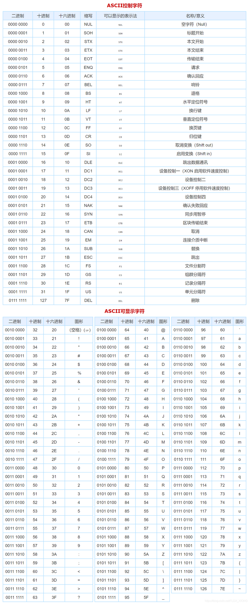
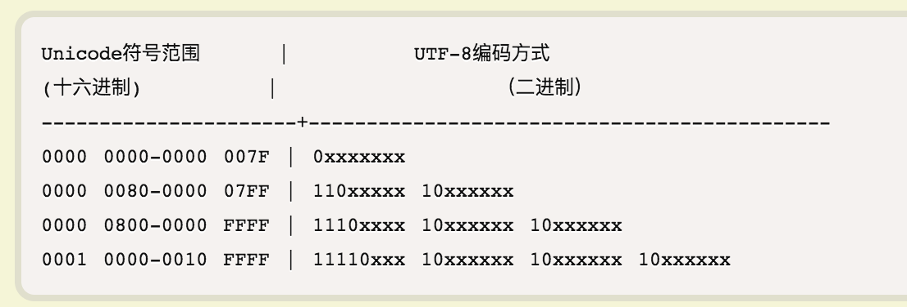
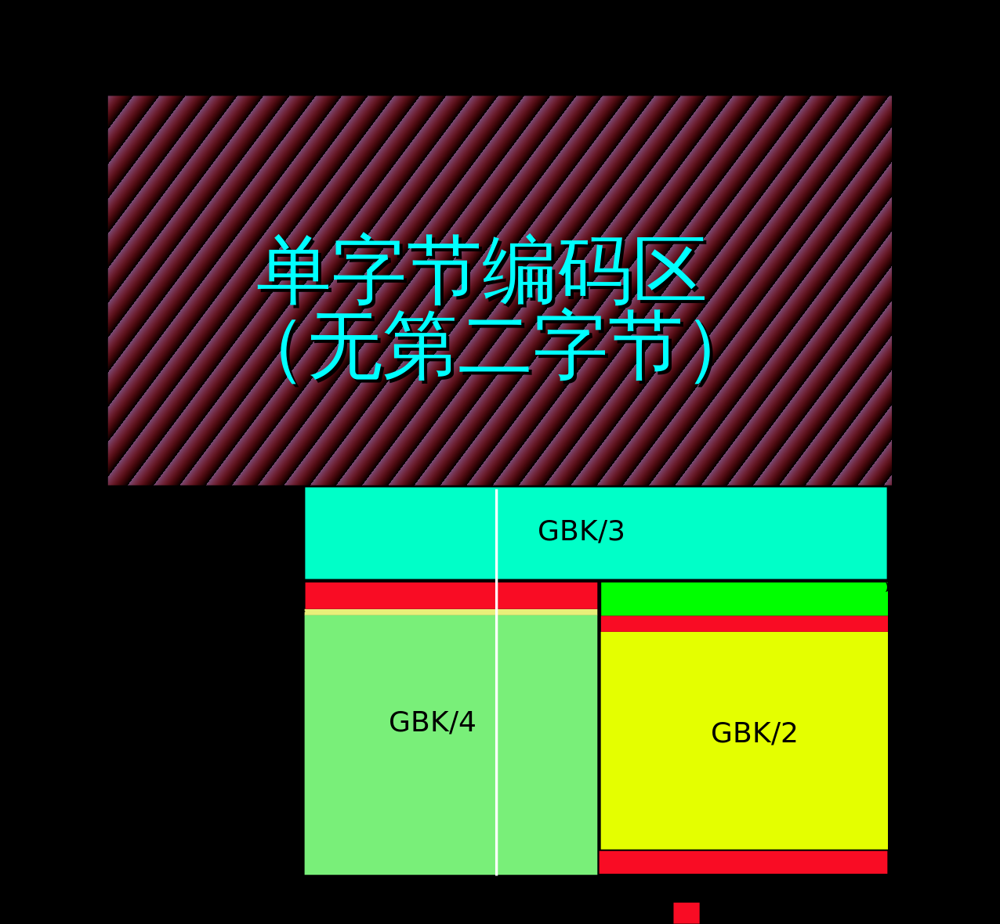

## ASCII
ASCII 码一共规定了128个字符的编码，比如空格SPACE是32（二进制00100000），大写的字母A是65（二进制01000001）。这128个符号（包括32个不能打印出来的控制符号），只占用了一个字节的后面7位，最前面的一位统一规定为0。

**可显示字段和控制字段**

## UTF-8
UTF-8 是在互联网上使用最广的一种 Unicode 的实现方式，其他实现方式还包括 UTF-16（字符用两个字节或四个字节表示）和 UTF-32（字符用四个字节表示）。UTF-8 最大的一个特点，就是它是一种变长的编码方式。它可以使用1~4个字节表示一个符号，根据不同的符号而变化字节长度。

UTF-8编码方式如下：

## GBK
GBK兼容ASCII，占用单字节或双字节来进行编码，编码范围如下：
