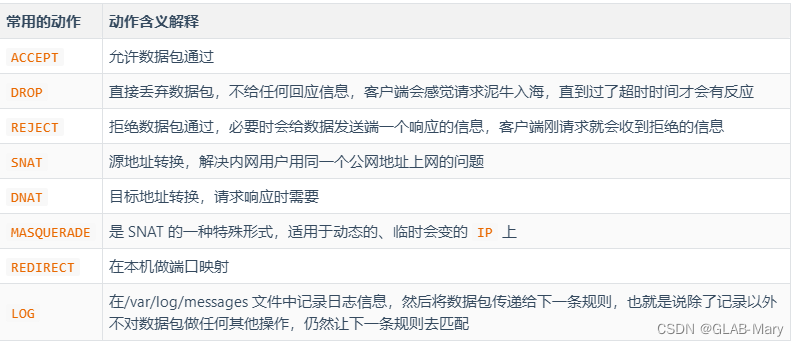

# **IPTables**

## 一、 iptables 结构
iptables组成包括表、链、规则、匹配条件、目标等。
1. **表（Tables）:**

	iptables默认包括4个规则表：
	- Filter Table (filter): 默认表，用于控制输入、输出和转发的数据包。
	- NAT Table (nat): 用于网络地址转换，即修改数据包的源或目的地址。
	- Mangle Table (mangle): 用于修改数据包的特定字段。
	- Raw Table (raw): 用于配置数据包的原始表。
2. **链（Chains）**:
在每个表中，有预定义的链，用于组织规则。常见的链包括：
	- INPUT: 处理输入数据包。
	- OUTPUT: 处理输出数据包。
	- FORWARD: 处理转发数据包。
	- PREROUTING: 处理数据包进入本地主机之前。
	- POSTROUTING: 处理数据包离开本地主机之后。

- 默认的表、链结构如图所示：

	规则表之间的执行顺序为raw>mangle->nat->filter，规则链之间的执行顺序为PREROUTING->(INPUT->OUTPUT)/FORWARD->POSTROUTING，规则链内按顺序进行检查，如果找不到相匹配的规则则按链的默认策略处理。当一个数据包进入网卡时，它首先进入PREROUTING链，内核根据数据包目的IP判断是否需要转送出去，如果数据包就是进入本机的，它就会沿着图向下移动，到达INPUT链。数据包到了INPUT链后，任何进程都会收到它。本机上运行的程序可以发送数据包，这些数据包会经过OUTPUT链，然后到达POSTROUTING链输出。如果数据包是要转发出去的，且内核允许转发，数据包就会经过FORWARD链，然后到达POSTROUTING链输出。
3. **规则（Rules）:**
每个链包含一系列规则，每个规则定义了数据包应该如何处理。规则根据匹配条件执行，如果数据包匹配规则的条件，则应用规则中定义的动作。

- 数据包传输过程如下：

4. **目标（target）：**

注：MASQUERADE 会动态的将源地址转换为可用的 IP 地址&#xff0c;其实与 SNAT 实现的功能完全一致&#xff0c;都是修改源地址&#xff0c;只不过 SNAT 需要指明将报文的源地址改为哪个 IP&#xff0c;而 MASQUERADE 则不用指定明确的 IP&#xff0c;会动态的将报文的源地址修改为指定网卡上可用的 IP 地址。
  

## 二、iptables规则管理

iptables规则管理和设置命令概览：

### 相关命令示例
- ``iptables -t filter -nvL`` //查看filter表的详细配置信息
- ``iptables-save`` //查看当前iptables的保存配置，打印到标准输出
- ``iptables -L --line-number`` //显示行号
- ``iptables -D DOCKER-ISOLATION-STAGE-1 1``//删除DOCKER-ISOLATION-STAGE-1链的行号为1的规则
- ``iptables -I DOCKER-ISOLATION-STAGE-1 -i trusted_zone -o untrusted_zone -j ACCEPT`` //添加规则到规则链开头，-A为末尾

